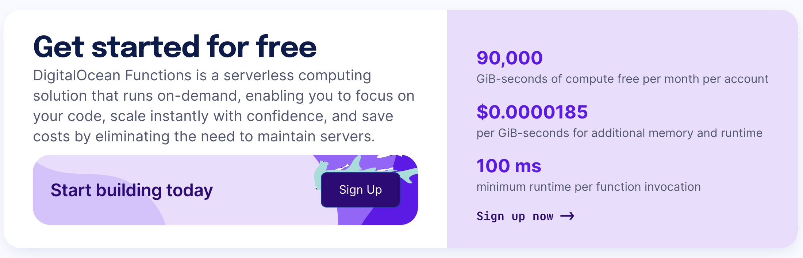

# 🙋Introduction

A starter repository for DigitalOcean Serverless functions in Nodejs with two starter functions:

1. Standard function (example-function)
2. Scheduled function (example-cron)

By downloading this boilerplate and following the instructions, you will be able to deploy your own functions to the DigitalOcean serverless platform within minutes.

## ✅ Requirements

1. [A DigitalOcean account](https://cloud.digitalocean.com/registrations/new)
2. [doctl](https://docs.digitalocean.com/reference/doctl/how-to/install/) installed on your local machine
3. [Nodejs](https://nodejs.org/en/) installed on your local machine

## 🏗️ Dependencies

### 🧑‍💻 Runtimes (Languages)

**DigitalOcean Serverless functions** are very versatile with the ability to run a variety of languages and frameworks. This boilerplate is written in Nodejs, though you can add modify the [project.yml](https://docs.digitalocean.com/products/functions/reference/project-configuration/) with any [runtime](https://docs.digitalocean.com/products/functions/reference/runtimes/) you see fit.

### 📦 Webpack

This boilerplate has been written with [Wepback](https://webpack.js.org/) which has required a [couple of customisations](https://docs.digitalocean.com/products/functions/reference/runtimes/node-js/#webpack).

Notably:

- `.include` file in the function to allow the `dist/bundle.js` file to be pushed to DigitalOcean on deploy
- `webpack.config.js` file to allow the `dist/bundle.js` file to be created - [see here for more details](https://webpack.js.org/configuration/)
- The 'webpack-cli' package has been added to the `package.json` file as a [devDependency](https://docs.npmjs.com/specifying-dependencies-and-devdependencies-in-a-package-json-file)

### 🧪 Testing with [Jest](https://jestjs.io/)

As per the sample provided by DigitalOcean, [Jest](https://jestjs.io/) has been included for testing with example tests provided. These can be run with the following command:

`npm run test`

from within the specific function directory (ie `example-function` or `example-cron`).

## Pricing

It is not pricy at all...actually right now, [there's even a free tier](https://www.digitalocean.com/pricing/functions), so definitely check it out!

# 🏃‍Getting Started 

## 🔗 Connecting to a Namespace

Assuming you have installed [doctl](https://docs.digitalocean.com/reference/doctl/how-to/install/) (the DigitalOcean command line tool), you need to connect to the DigitalOcean functions environment. This is initiated by the following command:

`doctl serverless connect`

You will be given the option to connect to a specific namespace; if you have not yet made one you can do so either in the [DigitalOcean dashboard](https://cloud.digitalocean.com/functions) or by running the following command:

`doctl serverless namespaces create --label "example-namespace" --region "nyc1"`

Be sure to replace "example namespace" with the **unique** name of your namespace. This will be used to group your functions together. If you would like to use a different region, you can find the [DigitalOcean Region Matrix here](https://docs.digitalocean.com/products/platform/availability-matrix/).

Alternatively, this is the known list in November 2023:

| Description                 | Code  |
|-----------------------------|-------|
| New York City, United States | nyc1  |
| New York City, United States | nyc3  |
| Amsterdam, the Netherlands  | ams3  |
| San Francisco, United States | sfo2  |
| San Francisco, United States | sfo3  |
| Singapore                   | sgp1  |
| London, United Kingdom      | lon1  |
| Frankfurt, Germany          | fra1  |
| Toronto, Canada             | tor1  |
| Bangalore, India            | blr1  |
| Sydney, Australia           | syd1  |

## 👷 [Set up the project.yml](https://docs.digitalocean.com/products/functions/reference/project-configuration/)

The project is configured via the `project.yml` file found in the root. In this file we define our functions and their various attributes:

- Code language
- Resource (ie Memory or Timeout)
- Schedule
- Environment variables

And so on. A full configuration guide can be [found here](https://docs.digitalocean.com/products/functions/reference/project-configuration/)

If a function is not listed in the yml, it will not be deployed; similarly if the function is defined but the corresponding directory is not present or mislabelled, it will fail to deploy.

### 🌐 Environment variables && parameters

Environment variables are configured in the root `project.yml` file and are passed to the function as parameters. [You can find more details here](https://docs.digitalocean.com/products/functions/reference/parameters-responses/).

But essentially, if you put your secrets in your `.env` file, then the `project.yml` file you can then call those variables in your javascript files as usual:

`process.env.MY_SECRET`

Both sample functions have been set up to demonstrate this, along with the `.sample.env` file.

## ⚙️ Creating new functions 

To create a new function, you can either copy the `example-function` or `example-cron` directories and rename them to your desired function name. Be sure to update the `project.yml` file to include your new function.

You are also welcome to make your own via the command line or in your IDE! Or using the command line from the root

`## New directory
mkdir -p packages/package/new-function
cd packages/package/new-function
npm init -y` 

Just be sure to set up the new function in a compliant manner if you do it this way. You can read a full guide on creating a [DigitalOcean Function here](https://docs.digitalocean.com/products/functions/how-to/create-functions/) and the specifics regarding [Nodejs Runtime here](https://docs.digitalocean.com/products/functions/reference/runtimes/node-js/).

## 🚚 Deploying functions

To deploy functions you've been working on, use this command:

`doctl serverless deploy .`

This may take a while and there's not much indication of progress, but don't worry it's just doing its thing.

*Please note: running `npm install` or `npm update` are not required before deployment if you have updated any specifics This occurs during deployment*.

## 📣 Invoking the function

Once deployed, you can invoke the function directly from the dashboard or directly from the command line:

`doctl serverless functions invoke package/example-function`

## 🪵Checking Logs

Logs are more than just [US Presidents](https://en.wikipedia.org/wiki/Log_cabin#:~:text=The%20log%20cabin%20has%20been,Garfield.), they're critical to development too!

### 𝌘 Tailing logs

Want an active log feed for all your functions? Use this command:

`doctl serverless activations logs --follow`

Want an active log feed for a specific function? Use this command:

`doctl serverless activations logs --follow --function package/example-function`

### 🔖 Viewing Static logs

Want to see your static logs? Use this command:

`doctl serverless activations logs --limit 5`

The `--limit` flag default is 1, so might be a good idea to raise that figure, like we have here.

